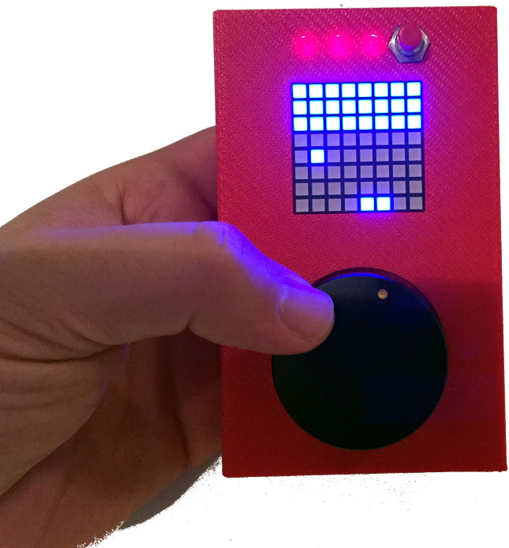

TeleBall - Retro Handheld Game Console
======================================

What is TeleBall?
-----------------

TeleBall is a handheld game console. It lets you play **BreakOut** in
single-player mode using one device and **Tennis for Two** in multi-player
mode using two devices communicating via radio.

TeleBall is pretty retro and very minimalistic: It features an
8x8 pixel LED matrix display, a paddle as game controller and one button.
Therefore, the range of possible games is limited but you will be surprised
how much fun and even zenlike meditation this kind of gameplay can bring you,
particularly when you play Tennis for Two with a friend.

About this GIT Repository
-------------------------

This repository contains everything you need to build your own TeleBall
device:

* CAD .stl and .cmb.gz data for your 3D printer or for any online 3D print
  shop to 3D print the TeleBall case

* Eagle PCB layout for any online PCB manufacturer to make the TeleBall PCB

* Part lists and hints how to build the hardware

* Arduino source code to flash the firmware

TeleBall is made using the
[Arduino Nano platform](http://arduino.cc/en/Main/ArduinoBoardNano) on a
custom PCB.

Browse TeleBall's project page for a much better documentation, including a
how-to play and how-to build guide and a bill of materials (BOM).

###Folder Structure

    cad:    CAD data for 3D printing the TeleBall case
            Use ".stl" to modify the design or to create a custom output file.
            Most online 3D print shops can use the ".cmb.gz" for production.
            Made with FreeCad: http://www.freecadweb.org

    doc:    HTML documentation; use "index.html" in root folder to browse

    eagle:  Electronic schematic diagram including PCB layout.
            The libraries.zip files are only needed, if you want to modify
            anything; otherwise you can just send the ".brd" file to any
            online PCB manufacturing company to receive a TeleBall PCB.
            Made with the freeware version of Eagle: http://www.cadsoftusa.com

    src:    Arduino source code aka Sketch in the subfolder "TeleBall".
            Compile and upload it to your device using Arduino's IDE. You need
            to install the libraries from libraries.zip first, before being
            able to compile. The "archive" folder contains historic versions.
            Made with Arduino: http://arduino.cc/de/Main/Software

The Makers
----------

TeleBall is brought to you by

* [sy2002](http://www.sy2002.de): idea, code and original circurit design
* doubleflash: additional circurit design and board layout
* lamags: body housing/case

TeleBall is a project of 
[MEGA - Museum of Electronic Games & Art](http://www.m-e-g-a.org).

We are looking forward to hearing from you. Email to code at sy2002.de

